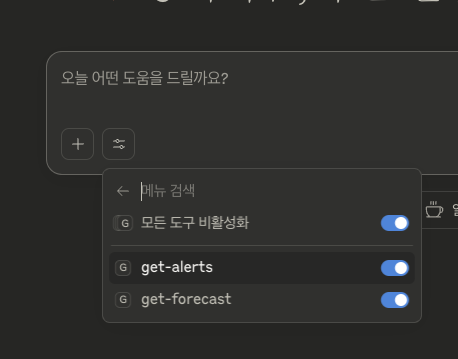

# ts-mcp server

## install dependencies

```sh
npm install @modelcontextprotocol/sdk zod
npm install -D @types/node typescript
```

## mcp

```sh
code ~/Library/Application\ Support/Claude/claude_desktop_config.json
```

```json
{
  "mcpServers": {
    "weather": {
      "command": "node",
      "args": ["/Users/idong-gyu/dev/mcp/mcp-ts/dist/index.js"]
    }
  }
}
```

## Results


